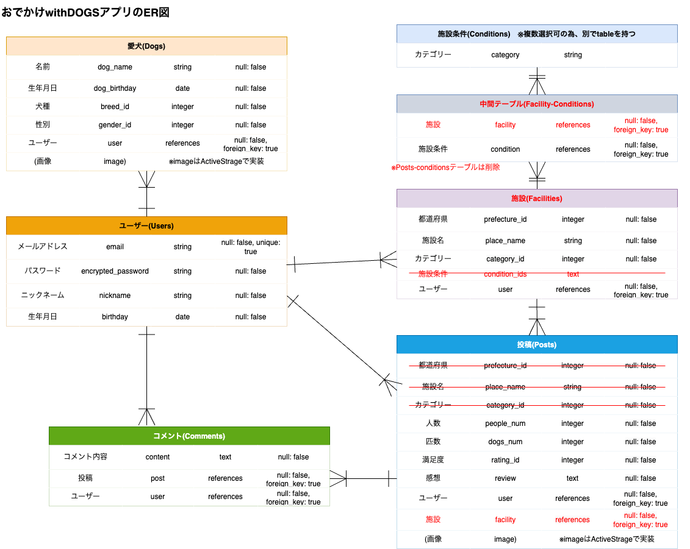
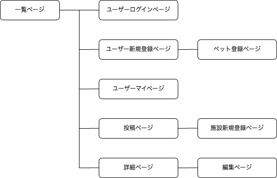

# アプリケーション名
おでかけ with DOGS

# アプリケーション概要
愛犬と一緒におでかけした情報を投稿し合うことで、愛犬家さんたちが安心しておでかけを楽しめる場所を共有できる。

# アプリケーションを作成した背景
私自身が犬を飼っていて、休みのたびにドッグランやカフェ、アクティビティへ一緒に遊びに行くのが好きだが、なかなか愛犬同伴可の施設がない。 
また、インターネットで調べるにも、満足できる最新情報が見れたり、愛犬家ならではの検索条件(キャリーケースに入れる必要があるか…等)で調べることが難しかった。 
たまにインスタで気になった写真からお出かけ場所を探すこともあるので、お出かけ場所の検索サイトとインスタグラムのいいところ取りをしたSNSを作ろうと考えた。

# URL
※公開終了しました  
[~~https://owdapp.onrender.com/~~](https://owdapp.onrender.com/)

# テスト用アカウント
~~* メールアドレス：test1@tt~~  
~~* パスワード：test111~~

# 利用方法
## ユーザー登録・マイページ
1. トップページまたは各ページのヘッダーからユーザー登録を行う
1. ヘッダーの「こんにちは！〇〇さん」のユーザー名部分をクリックし、マイページへ移動する
1. 「！愛犬登録はこちら！」から愛犬の情報を登録する
1. マイページでは、ユーザーと愛犬の紹介、そのユーザーの投稿一覧を見ることができる

## 施設登録・選択
1. トップページまたは各ページのヘッダーから施設一覧ページへ移動し、登録済の施設の選択ができる
1. 投稿したい施設の情報が未登録の場合は、「施設登録画面へ」のボタンから施設新規登録ページへ移動し、登録できる
1. 登録が完了したら、施設詳細ページへ遷移する
1. ログイン中かつユーザーがその登録者である場合のみ、施設情報を編集/削除できる

## おでかけ情報投稿
1. 施設一覧画面から投稿したい施設を選択or施設新規登録後の施設詳細画面から、おでかけ情報を投稿する（写真は5枚まで投稿できる）
1. 投稿が完了したら、トップページのフォトギャラリーおよびマイページから内容を確認できる
1. 各投稿のタイトルをクリックすると投稿詳細ページへ遷移する
1. ログイン中かつユーザーがその投稿者である場合のみ、投稿を編集/削除できる

## タグ付け機能
1. お出かけ情報投稿時にタグを複数付与できる（投稿編集での編集も可能）
1. トップページからタグ一覧ページへ移動し、タグ一覧と現在そのタグが紐付けられている投稿が何件あるかを確認できる
1. 各ページの「タグ名」をクリックしたら、そのタグが紐付けられている投稿一覧を見ることが出来る

## フォトギャラリー
1. トップページのフォトギャラリーに全ての投稿が掲載される
1. フォトギャラリーの写真部分をクリックすると、画像がポップアップで拡大表示され、複数の写真が投稿されている場合は、◁ / ▷のボタンを押すと別の写真に切り替わる
1. 投稿タイトルをクリックすると投稿詳細ページへ遷移し、ログイン中であればその投稿に対してコメントができる
1. 投稿者名をクリックすると、投稿者のマイページへ遷移する

## 検索機能
1. トップページの検索フォームで絞り込みたい条件を設定すると、検索(絞り込み)が出来る

# データベース設計

# 画面遷移図

# 開発環境
* フロントエンド：HTML / CSS / JavaScript / jQuery
* バックエンド：ruby / Ruby on Rails
* インフラ：Render
* テスト：Rspec
* テキストエディタ：Visual Studio Code
* タスク管理：GitHub

# ローカルでの動作方法
% git clone https://github.com/chisatom0908/odekake-with-dogs.git 
% cd /odekake-with-dogs 
% bundle install 
% yarn install

# 工夫したポイント
* 新規施設登録：「施設の条件」を複数選択できるように、チェックボックスで登録するようにした
* フォトギャラリー：画像をクリックしたら拡大表示されるようにした
* 愛犬登録：マイページから愛犬登録をできるようにして、投稿者のことがより分かるようにした
* タグ付け機能：新規投稿・編集の際、タグを追加・削除をJavascriptを使用して動的にすることで、操作性を高めた
* 検索機能：ransack, select2-railsを使用して実装することで、複雑な検索を省力的に実現できた

# 改善点
* 投稿機能にキーワード検索や検索結果並べ替えなどを追加
* 投稿のお気に入り登録や、ユーザーのフォロー・交流ページなどの機能を実装し、ユーザー同士が交流できる機能を追加
* （各種テストを継続して実施）

# 制作時間
2023/8/22〜9/8 : 約100時間(独力) 
2023/11/20〜12/21 : 約180時間(新人研修内)
