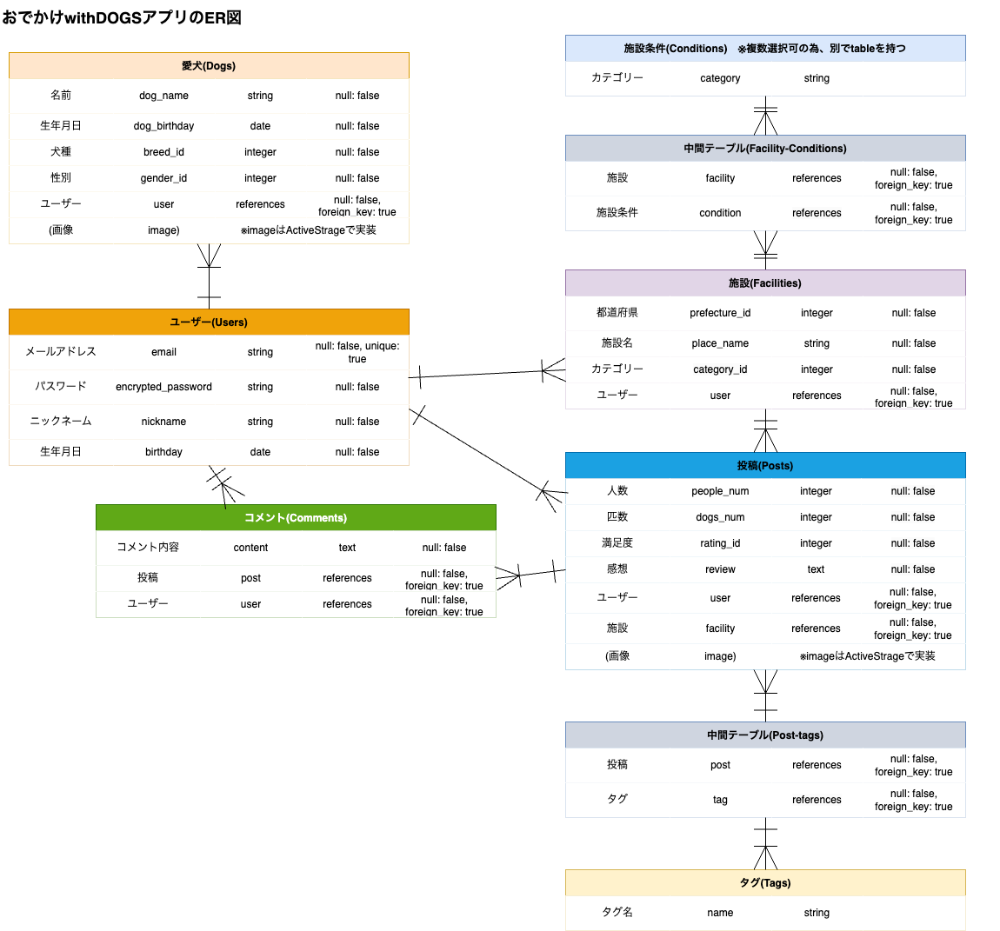

# アプリケーション名
おでかけ with DOGS

# アプリケーション概要
愛犬と一緒におでかけした情報を投稿し合うことで、愛犬家さんたちが安心しておでかけを楽しめる場所を共有できる。

# URL
※公開終了しました  
[~~https://owdapp.onrender.com/~~](https://owdapp.onrender.com/)

# テスト用アカウント
~~* メールアドレス：test1@tt~~  
~~* パスワード：test111~~

# 利用方法
## ユーザー登録・マイページ
1. トップページまたは各ページのヘッダーからユーザー登録を行う
2. ヘッダーの「こんにちは！〇〇さん」のユーザー名部分をクリックし、マイページへ移動する
3. 「！愛犬登録はこちら！」から愛犬の情報を登録する
4. マイページでは、ユーザーと愛犬の紹介、そのユーザーの投稿一覧を見ることができる

## おでかけ情報投稿
1. トップページまたは各ページのヘッダーからおでかけ情報を投稿する 写真は5枚まで投稿できる
2. 投稿が完了したら、トップページのフォトギャラリーおよびマイページから内容を確認できる
3. 各投稿のタイトルをクリックすると投稿詳細ページへ遷移する
4. ログイン中かつユーザーがその投稿者である場合のみ、投稿を編集/削除できる 

## フォトギャラリー
1. トップページのフォトギャラリーに全ての投稿が掲載される 
2. 「全国」タブに全投稿が表示され、「北海道」〜「沖縄」タブをクリックすると、各地域のおでかけ情報のみが表示される
3. フォトギャラリーの写真部分をクリックすると、画像がポップアップで拡大表示され、複数の写真が投稿されている場合は、◁ / ▷のボタンを押すと別の写真に切り替わる
4. 投稿タイトルをクリックすると投稿詳細ページへ遷移し、ログイン中であればその投稿に対してコメントができる
5. 投稿者名をクリックすると、投稿者のマイページへ遷移する

# アプリケーションを作成した背景
私自身が犬を飼っていて、休みのたびにドッグランやカフェ、アクティビティへ一緒に遊びに行くのが好きだが、なかなか愛犬同伴可の施設がない。 
また、インターネットで調べるにも、満足できる最新情報が見れたり、愛犬家ならではの検索条件(キャリーケースに入れる必要があるか…等)で調べることが難しかった。 
たまにインスタで気になった写真からお出かけ場所を探すこともあるので、お出かけ場所の検索サイトとインスタグラムのいいところ取りをしたSNSを作ろうと考えた。

# 洗い出した要件
[要件定義シート](https://docs.google.com/spreadsheets/d/1Pfva2BxIFWFZFsIcKXZoN_hDB3dcwBedTRjRJKHg7zE/edit?usp=sharing)

# 実装した機能についての画像やGIFおよびその説明
1. 新規ユーザー登録

https://github.com/chisatom0908/odekake-with-dogs/assets/139729122/f8f6812d-8554-407f-bd03-a43d9d0e925a

2. 新規投稿・一覧表示・詳細表示

https://github.com/chisatom0908/odekake-with-dogs/assets/139729122/626c147c-5ff7-48db-b317-9d3bd863b4dd

3. 愛犬登録

https://github.com/chisatom0908/odekake-with-dogs/assets/139729122/d2ac345c-477a-4dbe-9a80-24cc52f09eb7

# 実装予定の機能
* 現在検索機能を実装中
* 今後は投稿のお気に入り登録や、ユーザーのフォローなどの機能を実装予定

# データベース設計

# 画面遷移図

# 開発環境
* フロントエンド：HTML / CSS / JavaScript / jQuery
* バックエンド：ruby / Ruby on Rails
* インフラ：Render
* テスト：Rspec
* テキストエディタ：Visual Studio Code
* タスク管理：GitHub

# ローカルでの動作方法
% git clone https://github.com/chisatom0908/odekake-with-dogs.git 
% cd /odekake-with-dogs 
% bundle install 
% yarn install

# 工夫したポイント
* 新規投稿：「施設の条件」を複数選択できるように、チェックボックスで登録するようにした

* フォトギャラリー：タブで地域ごとに投稿を見られるようにしたり、画像をクリックしたら拡大表示されるようにした

https://github.com/chisatom0908/odekake-with-dogs/assets/139729122/88675645-7309-43bc-bb04-2ff0e42518cc

* 愛犬登録：マイページから愛犬登録をできるようにして、投稿者のことがより分かるようにした

# 改善点
* 投稿を検索できない状態のため、検索機能を実装中
* 今後は投稿のお気に入り登録や、ユーザーのフォロー・交流ページなどの機能を実装し、ユーザー同士が交流できる機能を追加したい

# 制作時間
2023/8/22〜9/8  
約100時間
